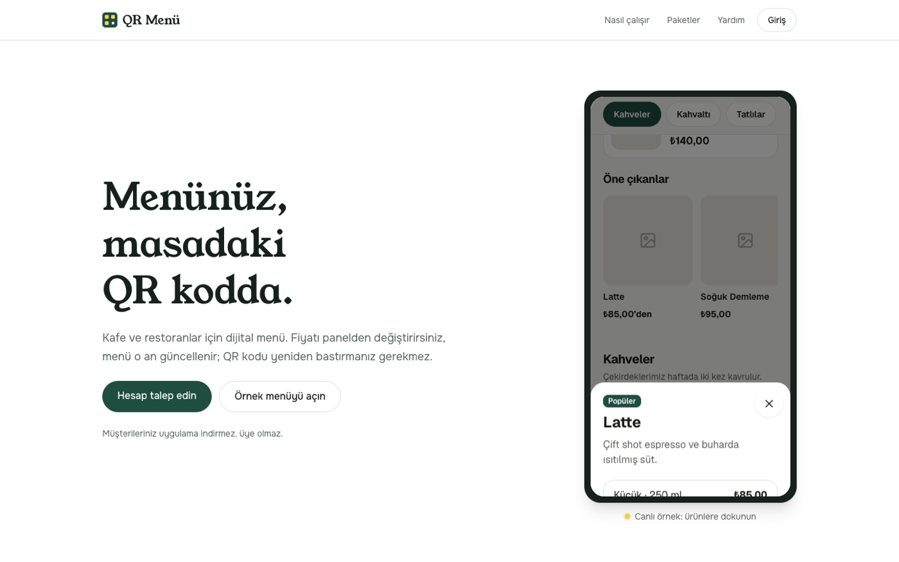
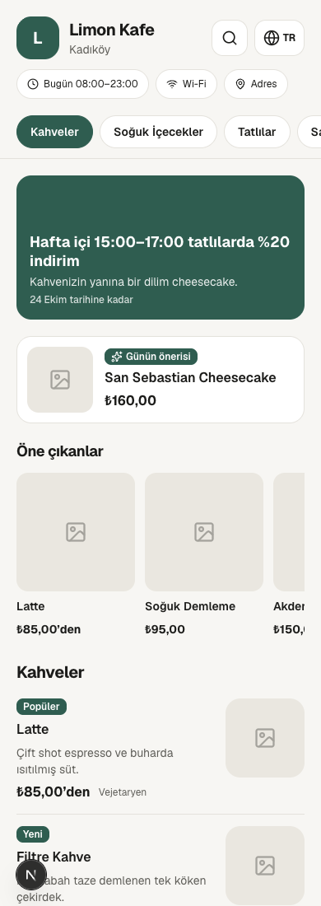
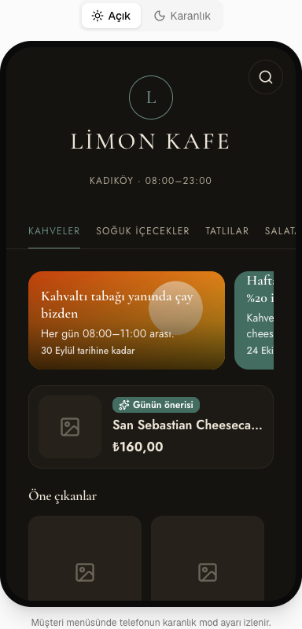
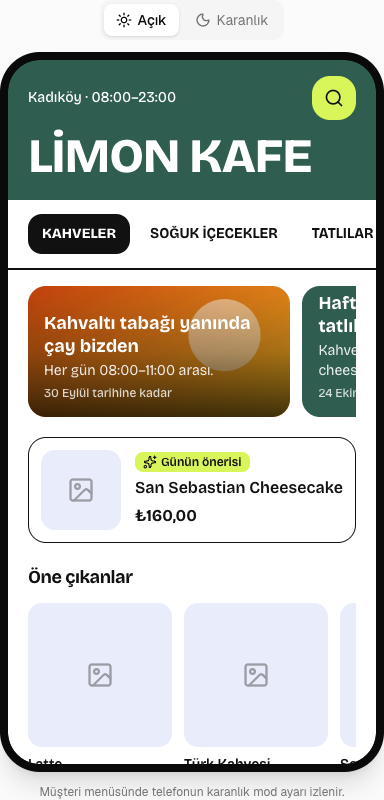
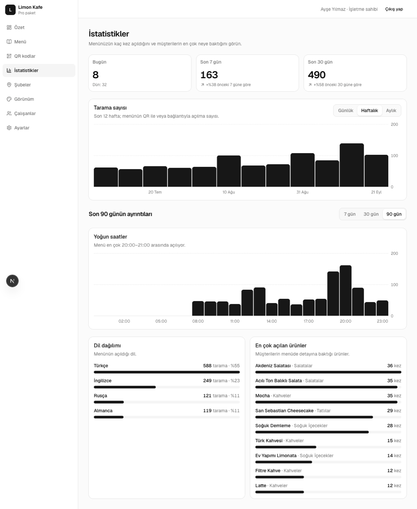
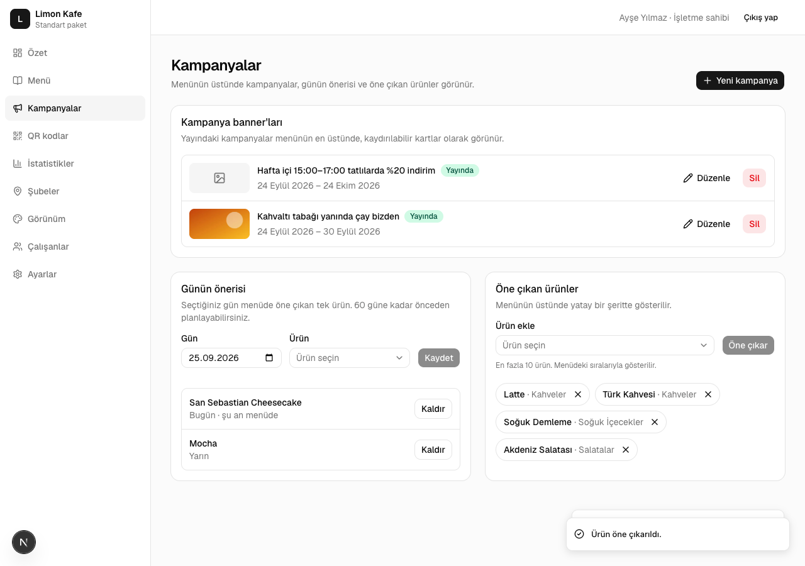
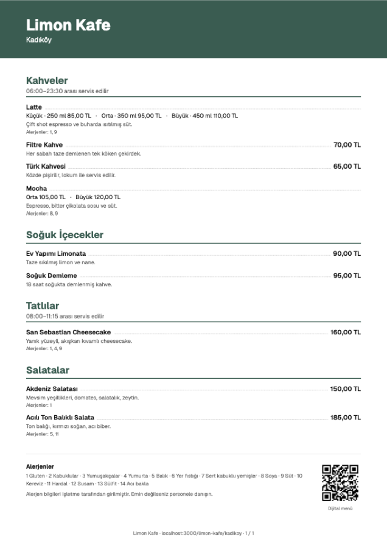
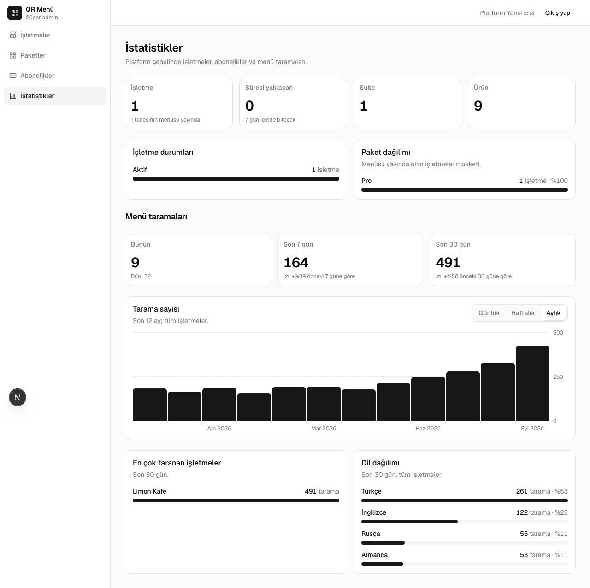

# QR Menü

Restoran ve kafeler için çok işletmeli dijital menü platformu. İşletme menüsünü panelden yönetir; müşteri masadaki QR kodu okutur ve menü telefonunda açılır. Uygulama indirmek, üye olmak veya kişisel bilgi vermek gerekmez.

Sistem yalnızca menü göstermek içindir: sipariş, sepet veya ödeme yoktur.



## Özellikler

**Müşteri menüsü**

- Dört tema (Minimal, Lüks, Sıcak, Canlı), işletmenin logosu ve rengiyle; karanlık mod
- Fotoğraflı ürünler, boy ve porsiyon fiyatları, besin değerleri, acılık, rozetler
- 5 dil (Türkçe, İngilizce, Almanca, Rusça, Arapça, sağdan sola yazım dahil)
- Arama ve "şunu içermesin" alerjen / diyet filtresi
- Kampanya banner'ları, günün önerisi, öne çıkan ürünler
- Yalnızca belirli saatlerde görünen kategoriler (ör. kahvaltı)
- Hızlı: sunucuda üretilir ve önbelleğe alınır; Lighthouse mobil puanı 95

**İşletme paneli**

- Kategori ve ürün yönetimi, sürükle-bırak sıralama, çoklu görsel
- Tek dokunuşla "tükendi", toplu fiyat güncelleme, menüyü şubeler arasında kopyalama
- Excel'den ürün içe aktarma ve menüyü Excel olarak indirme
- Şubeler, çeviriler, görünüm, yetkileri ayrı ayrı verilebilen çalışanlar
- QR kod (PNG, SVG) ve baskı şablonları (masa kartı, sticker, A4 poster)
- İstatistikler: günlük / haftalık / aylık tarama, yoğun saatler, dil dağılımı, en çok bakılan ürünler
- Pro pakette işletmenin kendi alan adı (`menu.isletme.com`), otomatik SSL ile

**Yasal kolaylıklar**

- Yasal 14 alerjen, "içerir" ve "iz miktarda içerebilir" ayrımıyla
- Alerjen tablosu PDF'i (müşteri menüden de indirebilir) ve fiyatlı basılı menü PDF'i
- Müşteriden çerez, IP veya kişisel veri toplanmaz

**Platform yönetimi (süper admin)**

- İşletme açma, paket tanımlama, abonelik başlatma, uzatma ve askıya alma
- Abonelik bitişine 7 gün kala panel uyarısı ve e-posta
- "İşletmenin gözünden bak": işletme panelini salt okunur görüntüleme
- Platform geneli istatistikler

## Ekran görüntüleri

| Müşteri menüsü                          | Lüks tema                               | Canlı tema                                |
| --------------------------------------- | --------------------------------------- | ----------------------------------------- |
|  |  |  |

| İstatistikler                                   | Kampanyalar                                 |
| ----------------------------------------------- | ------------------------------------------- |
|  |  |

| Basılı menü (PDF)                           | Süper admin istatistikleri            |
| ------------------------------------------- | ------------------------------------- |
|  |  |

## Teknolojiler

| İş               | Araç                                           |
| ---------------- | ---------------------------------------------- |
| Uygulama         | Next.js 16 (App Router), React 19, TypeScript  |
| Veritabanı       | PostgreSQL, Prisma                             |
| Kimlik doğrulama | Better Auth (e-posta + şifre)                  |
| Arayüz           | Tailwind CSS, shadcn/ui (panel), Motion (menü) |
| Doğrulama        | Zod                                            |
| Görseller        | sharp, Cloudflare R2 (S3 uyumlu)               |
| PDF, QR, Excel   | @react-pdf/renderer, qrcode, ExcelJS           |
| Çeviri           | next-intl                                      |
| Test             | Vitest, Playwright                             |
| Barındırma       | Docker, Caddy (otomatik SSL), GlitchTip        |

Tek proje, tek dağıtım: ayrı bir backend yoktur. Veri Server Component'lerde okunur, Server Action'larla yazılır.

## Yerel kurulum

Gerekenler: Node.js 20.9+, Docker.

```bash
cp .env.example .env          # BETTER_AUTH_SECRET için: openssl rand -base64 32
docker compose up -d          # PostgreSQL + Mailpit (e-posta) + S3Mock (görseller)
npm install                   # Prisma istemcisi de üretilir
npm run db:reset              # tabloları kurar + örnek veri (seed)
npm run dev                   # http://localhost:3000
```

- Gönderilen e-postalar Mailpit'te görünür: http://localhost:8025
- Görseller yerelde S3 uyumlu S3Mock'a yüklenir (`R2_ENDPOINT=http://localhost:9090`).

### Örnek hesaplar (yalnızca yerel)

Şifre: `.env` içindeki `SEED_PASSWORD` (boşsa `degistir-beni-123`; canlıda zorunludur).

| Rol            | E-posta                  |
| -------------- | ------------------------ |
| Süper admin    | `admin@qrmenu.local`     |
| İşletme sahibi | `sahip@limonkafe.test`   |
| Çalışan        | `calisan@limonkafe.test` |

Örnek menü: http://localhost:3000/limon-kafe/kadikoy · Tanıtım sayfası: http://localhost:3000

## Komutlar

| Komut                | Ne yapar                                       |
| -------------------- | ---------------------------------------------- |
| `npm run dev`        | Geliştirme sunucusu                            |
| `npm run build`      | Canlı derleme                                  |
| `npm start`          | Derlenmiş uygulamayı açar                      |
| `npm test`           | Birim testleri (Vitest)                        |
| `npm run test:e2e`   | Uçtan uca testler (Playwright)                 |
| `npm run typecheck`  | Tip kontrolü                                   |
| `npm run lint`       | ESLint                                         |
| `npm run format`     | Prettier ile biçimlendir                       |
| `npm run db:migrate` | Şema değişikliği → migration + istemci         |
| `npm run db:seed`    | Örnek verileri ekler                           |
| `npm run db:reset`   | Yerel veritabanını sıfırlar ve seed çalıştırır |

Uçtan uca testler seed'li yerel veritabanı ister; açık sunucu yoksa üretim derlemesi alınıp başlatılır. İlk kullanımda tarayıcı: `npx playwright install chromium`.

## Klasörler

```
app/
  (site)/        Tanıtım sayfası, yardım merkezi
  (menu)/        Müşteri menüsü: /{işletme}/{şube} ve işletmenin kendi alan adı
  (panel)/       İşletme paneli (/panel)
  (admin)/       Süper admin paneli (/admin)
  (auth)/        Giriş, şifre sıfırlama
  demo/          Örnek menü
  api/           Dosya dönen uçlar: görsel yükleme, QR, PDF, Excel, zamanlanmış görev
actions/         Server Action'lar (veri yazma)
components/      menu/ (müşteri menüsü, temalar), panel/, ui/ (shadcn)
lib/             Veritabanı, oturum, yetki, paket limitleri, önbellek, PDF, doğrulama
prisma/          Şema, migration'lar, seed
e2e/             Playwright testleri
docs/            Canlıya alma rehberi, kararlar
raporlar/        Geliştirme adımlarının raporları
```

## Canlıya alma

VPS'te Docker Compose ile çalışır: uygulama, PostgreSQL, Caddy (otomatik SSL), saatlik zamanlanmış görev ve isteğe bağlı GlitchTip (hata izleme). Adım adım rehber: **[docs/YAYIN.md](docs/YAYIN.md)**. Kurulum, alan adı, işletmelerin kendi alan adları, yedekleme ve güncelleme orada anlatılıyor.

Ortam değişkenleri: [.env.production.example](.env.production.example)

## Dokümanlar

- [docs/YAYIN.md](docs/YAYIN.md): VPS kurulumu, güncelleme, yedekleme
- [docs/KARARLAR.md](docs/KARARLAR.md): teknik kararlar ve gerekçeleri
- [raporlar/](raporlar/): her geliştirme adımının raporu (ne yapıldı, nasıl doğrulandı)

## Lisans

Bu depo için henüz bir lisans belirlenmedi. Lisans eklenene kadar tüm hakları saklıdır.
